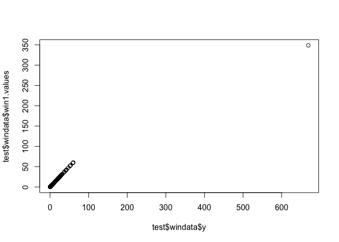

<!-- README.md is generated from README.Rmd. Please edit that file -->
### surveyoutliers

This package contains various procedures to deal with outliers in survey data. The only method available at present is to calculate optimal winsorising cutoffs as described in Kokic and Bell (1994) and Clark (1995).

### Installation

``` r
library(devtools)
devtools::install_github("rgcstats/surveyoutliers")
```

### Quick demo

``` r
library(surveyoutliers)
# The dataset test contains a variable of interest y, and generalized regression
#  weights regwt, inverse probabilities of selection piwt
# The following code calculates the optimal tuning parameter and hence winsorised values via optimal.onesided.cutoff().
test <- optimal.onesided.cutoff(formula=y~x1+x2,surveydata=survdat.example)
# Show the results by plotting the winsorised vs the raw values of the variable of interest:
plot(test$windata$y,test$windata$win1.values)
```



#### References

Clark, R. G. (1995), "Winsorisation methods in sample surveys," Masters thesis, Australian National University, <http://hdl.handle.net/10440/1031>.

Kokic, P. and Bell, P. (1994), "Optimal winsorizing cutoffs for a stratified finite population estimator," J. Off. Stat., 10, 419-435.
